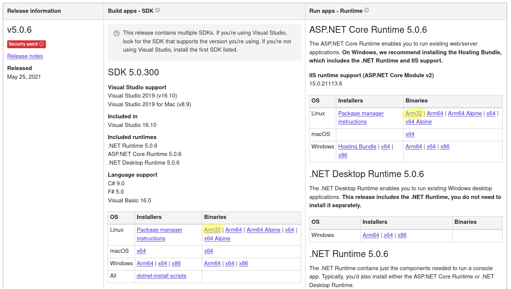
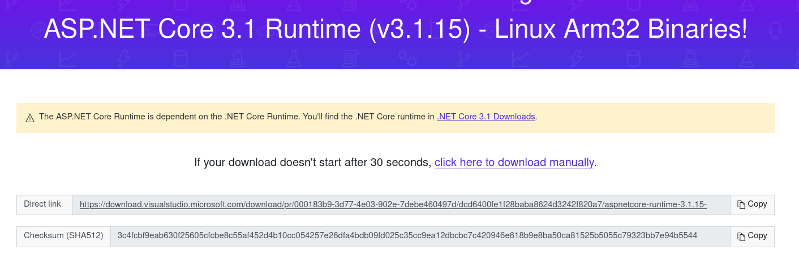

# raspberry_install_dotnet
Install .NET (dotnet) environment on the Raspberry PI

Currently the Arm32 installation is uesd. 

# Adding another version
On the download page go select under the section `SDK` and `ASP.NET Core Runtime` the `Arm32` variant. Once on the download page copy the direct link and add it in the files.

# Links

[dotnet 3.1](https://dotnet.microsoft.com/download/dotnet/3.1)

[dotnet 5.0](https://dotnet.microsoft.com/download/dotnet/5.0)